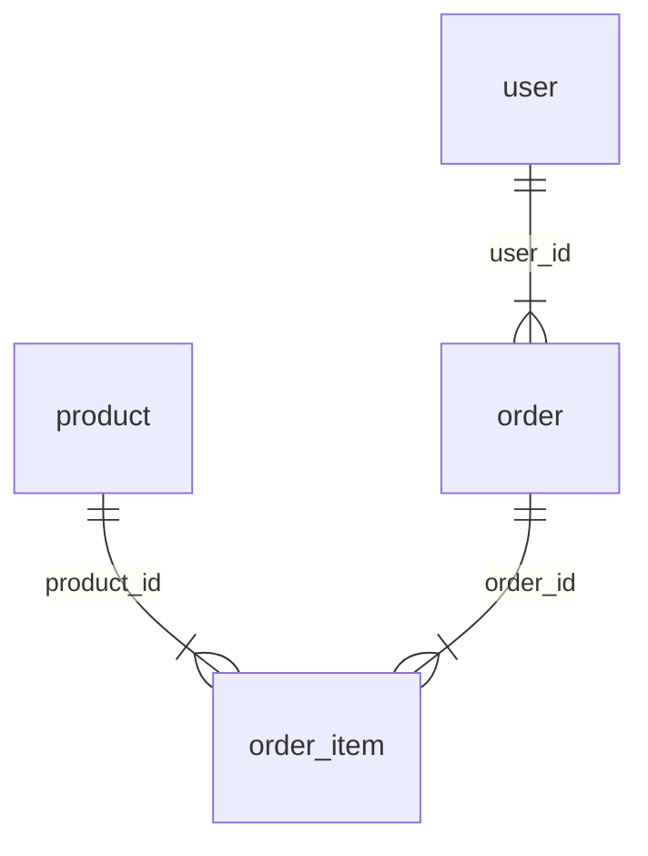

# 业务场景模拟器 - 网页版设计文档

**日期**: 2026-05-08
**状态**: 已完成

---

## 一、概述

用户输入一个行业名称（如"电商"、"医疗"、"物流"）和探查深度（1/2/≥3），自动生成该行业的业务场景模拟网页，包含：

- 业务线清单及描述
- 各业务线下的业务流程（文字 + Mermaid 流程图）
- 业务流程涉及的表结构（DDL + 字段清单）
- 表中模拟的真实数据（INSERT 语句 + 表格预览）
- ER 关系图（展示表间关联）

输出为**单文件静态 HTML**，双击即可打开，无需任何服务器或构建工具。

---

## 二、输入输出

### 输入

| 参数 | 类型 | 说明 |
|------|------|------|
| 行业名称 | 文本 | 如"电商"、"金融"、"医疗"、"教育" |
| 探查深度 | 数字 | 1=轻量级, 2=中等, ≥3=深度建模 |

### 深度参数映射

| 探查次数 | 业务线数 | 每业务表数 | 每表字段数 | 流程描述 | 模拟数据量 |
|---------|---------|-----------|-----------|---------|-----------|
| 1 | 2-3 | 3-5 | 5-8 | 纯文字描述 | 每表 5-10 条 |
| 2 | 4-5 | 5-10 | 8-12 | 文字 + Mermaid 流程图 | 每表 10-20 条 |
| ≥3 | 5-8 | 10-20 | 12-20 | 完整流程图 + 异常分支 | 每表 20-50 条 |

**字段完整性原则：**
- **深度=1**：每张表必须包含支撑业务流程的核心字段，至少包括：主键、必要外键、关键业务属性（如名称/金额/状态）、创建时间。不可只给 2-3 个字段。
- **深度=2**：在核心字段基础上，补充常用业务字段（如更新时间、操作人、备注、分类/标签等）。
- **深度=3**：进一步补充扩展字段（如冗余字段、审计字段、扩展属性、软删除标记、版本号等），贴近生产环境表结构。

### 输出

单个 HTML 文件，包含完整交互界面。

---

## 三、页面布局

### 3.1 整体框架

```
┌──────────────────────────────────────────────────────────────────┐
│  📊 业务场景模拟器                                                  │
│  行业：[电商____]  深度：[2 - 中等 ▼]  [▶ 生成]                      │
│                                      行业：电商  深度：中等(2)  生成：2026-05-09 10:30 │
├──────────────┬───────────────────────────────────────────────────┤
│              │  [业务流程]  [表结构]  [模拟数据]  [ER图]            │
│  全部展开     │  ───────────────────────────────────────────────  │
│              │                                                   │
│  ▼ 商品管理   │  【当前选中流程的内容区域】                          │
│    ├ 商品录入 │                                                   │
│    └ 库存管理 │                                                   │
│              │                                                   │
│  ▶ 订单交易   │                                                   │
│              │                                                   │
│  ▶ 用户中心   │                                                   │
│              │                                                   │
│  ▶ 营销推广   │                                                   │
│              │                                                   │
│  ▶ 物流履约   │                                                   │
│              │                                                   │
├──────────────┴───────────────────────────────────────────────────┤
│  📦 共 5 个业务线 · 25 张表 · 深度：2 · 生成时间：2026-05-09 10:30 │
└──────────────────────────────────────────────────────────────────┘
```

### 3.2 Tab 1 — 业务流程

```
┌──────────────────────────────────────────────────────────────────┐
│  商品录入与审核                                          [卡片]    │
│                                                                  │
│  商家提交商品信息，平台进行资质与内容审核，通过后自动上架。          │
│  审核不通过则退回修改，支持多次提交。                                │
│                                                                  │
├──────────────────────────────────────────────────────────────────┤
│  流程图                                                  [卡片]    │
│                                                                  │
│         ┌─────────┐                                              │
│         │ 商家提交 │                                              │
│         └────┬────                                              │
│              ▼                                                    │
│         ┌─────────┐     通过     ┌─────────┐                      │
│         │ 平台审核 ├───→│ 自动上架 │                      │
│         └────┬────┘            └─────────┘                      │
│              │ 驳回                                              │
│              ▼                                                    │
│         ┌─────────┐                                              │
│         │ 修改重提 │                                              │
│         └─────────┘                                              │
│                                                                  │
├──────────────────────────────────────────────────────────────────┤
│  涉及数据表                                              [卡片]    │
│                                                                  │
│  • product                                                       │
│  • product_audit                                                 │
│                                                                  │
└──────────────────────────────────────────────────────────────────┘
```

### 3.3 Tab 2 — 表结构

```
┌──────────────────────────────────────────────────────────────────┐
│  product  商品表                                         [卡片]    │
│                                                                  │
│  ┌────────────┬──────────────┬─────────────────────────────────┐ │
│  │ 字段名       │ 类型           │ 说明                            │ │
│  ├────────────┼──────────────┼─────────────────────────────────┤ │
│  │ product_id │ BIGINT       │ 商品ID                            │ │
│  │   [PK]     │              │                                   │ │
│  ├────────────┼──────────────┼─────────────────────────────────┤ │
│  │ product_   │ VARCHAR(256) │ 商品名称                          │ │
│  │ name       │              │                                   │ │
│  ├────────────┼──────────────┼─────────────────────────────────┤ │
│  │ product_   │ VARCHAR(64)  │ 商品编码                          │ │
│  │ code       │              │                                   │ │
│  ├────────────┼──────────────┼─────────────────────────────────┤ │
│  │ category_  │ BIGINT       │ 类目ID                            │ │
│  │ id         │              │                                   │ │
│  ├────────────┼──────────────┼─────────────────────────────────┤ │
│  │ brand_id   │ BIGINT       │ 品牌ID                            │ │
│  ├────────────┼──────────────┼─────────────────────────────────┤ │
│  │ price      │ DECIMAL(10,2)│ 售价                              │ │
│  ├────────────┼──────────────┼─────────────────────────────────┤ │
│  │ cost_price │ DECIMAL(10,2)│ 成本价                            │ │
│  ├────────────┼──────────────┼─────────────────────────────────┤ │
│  │ stock      │ INT          │ 库存数量                          │ │
│  ├────────────┼──────────────┼─────────────────────────────────┤ │
│  │ status     │ TINYINT      │ 状态 0下架 1上架 2审核中           │ │
│  ├────────────┼──────────────┼─────────────────────────────────┤ │
│  │ create_    │ DATETIME     │ 创建时间                          │ │
│  │ time       │              │                                   │ │
│  ├────────────┼──────────────┼─────────────────────────────────┤ │
│  │ update_    │ DATETIME     │ 更新时间                          │ │
│  │ time       │              │                                   │ │
│  └──────────────────────────┴─────────────────────────────────┘ │
│  (可滚动，字段超出时出现滚动条)                                     │
│                                                                  │
│  ┌────────────────────────────────────────────────────┐ [复制]   │
│  │ CREATE TABLE product (                             │          │
│  │   product_id BIGINT COMMENT '商品ID',              │          │
│  │   product_name VARCHAR(256) COMMENT '商品名称',    │          │
│  │   product_code VARCHAR(64) COMMENT '商品编码',     │          │
│  │   category_id BIGINT COMMENT '类目ID',             │          │
│  │   brand_id BIGINT COMMENT '品牌ID',                │          │
│  │   price DECIMAL(10,2) COMMENT '售价',              │          │
│  │   cost_price DECIMAL(10,2) COMMENT '成本价',       │          │
│  │   stock INT COMMENT '库存数量',                    │          │
│  │   status TINYINT COMMENT '状态 0下架 1上架 2审核中',│          │
│  │   create_time DATETIME COMMENT '创建时间',         │          │
│  │   update_time DATETIME COMMENT '更新时间'          │          │
│  │ ) COMMENT '商品表';                                │          │
│  └────────────────────────────────────────────────────┘          │
│                                                                  │
├──────────────────────────────────────────────────────────────────┤
│  product_audit  商品审核表                               [卡片]    │
│  ...（同上结构）                                                    │
└──────────────────────────────────────────────────────────────────┘
```

### 3.4 Tab 3 — 模拟数据

```
┌────────────────────────────────────────────────────────┐
│  product - 模拟数据 (5 条)                     [卡片]   │
│                                                        │
│  ┌──────┬──────────┬──────┬────────────┬────────┐    │
│  │ id   │ name     │price │stock │status│create  │    │
│  ├──────┼──────────┼──────┼──────┼──────┼────────┤    │
│  │ 1001 │ iPhone 15│ 5999 │ 500  │  1   │01-15   │    │
│  │ 1002 │ MacBook  │ 8999 │ 200  │  1   │01-20   │    │
│  │ 1003 │ AirPods  │ 1899 │1000  │  0   │02-01   │    │
│  │ 1004 │ 小米14   │ 5999 │ 300  │  1   │02-10   │    │
│  │ 1005 │ Redmi K70│ 2499 │ 800  │  2   │03-01   │    │
│  └──────┴──────────┴──────┴──────┴──────┴────────┘    │
│  (可滚动，超出时出现滚动条)                              │
│                                                        │
│  ┌──────────────────────────────────────────┐ [复制]  │
│  │ INSERT INTO product (id, name, price,    │         │
│  │   stock, status, create_time) VALUES     │         │
│  │   (1001, 'iPhone 15', 5999, 500, 1,      │         │
│  │    '2026-01-15 10:00:00');               │         │
│  │ ...                                      │         │
│  └──────────────────────────────────────────┘         │
│                                                        │
├────────────────────────────────────────────────────────┤
│  product_audit - 模拟数据 (5 条)               [卡片]   │
│  ...（同上结构）                                         │
└────────────────────────────────────────────────────────┘
```

### 3.5 Tab 4 — ER 图

```
┌────────────────────────────────────────────────────────┐
│  ER 关系图 — 商品管理                          [卡片]   │
│                                                        │
│        ┌──────────────┐                               │
│        │   product    │                               │
│        │ ──────────── │                               │
│        │ id        PK │                               │
│        │ name         │                               │
│        │ price        │                               │
│        │ status       │                               │
│        └──────┬───────┘                               │
│               │ 1:N                                    │
│               │ "product_id"                           │
│               ▼                                        │
│        ┌──────────────┐                               │
│        │product_audit │                               │
│        │ ──────────── │                               │
│        │ id        PK │                               │
│        │ product_id FK│◄──────────┐                   │
│        │ status       │           │                   │
│        │ audit_time   │           │                   │
│        └──────────────┘           │                   │
│                                   │                   │
│        ┌──────────────┐           │                   │
│        │inventory_log │           │                   │
│        │ ──────────── │           │                   │
│        │ id        PK │           │                   │
│        │ product_id FK│───────────┘                   │
│        │ change_type  │    1:N "product_id"           │
│        └──────────────┘                               │
│                                                        │
│  图例：══ 一对一  ═╦ 一对多  ═╩ 多对多/多对一           │
│                                                        │
└────────────────────────────────────────────────────────┘
```

---

## 四、技术架构

### 4.1 技术栈

| 组件 | 方案 | 说明 |
|------|------|------|
| 布局 | CSS Grid + Flexbox | 响应式三栏布局 |
| 左侧导航 | 纯 CSS + 少量 JS | 手风琴折叠菜单 |
| Tab 切换 | JS 控制 class | 无框架实现 |
| 流程图 | Mermaid CDN | `mermaid.min.js` |
| 代码高亮 | highlight.js CDN | DDL 语法高亮 |
| 数据生成 | 硬编码 API 配置 | 默认使用通义千问 qwen3.6-plus |

### 4.2 外部依赖（CDN）

```html
<script src="https://cdn.jsdelivr.net/npm/mermaid@10/dist/mermaid.min.js"></script>
<link rel="stylesheet" href="https://cdn.jsdelivr.net/npm/highlight.js@11/styles/github.min.css">
<script src="https://cdn.jsdelivr.net/npm/highlight.js@11/highlight.min.js"></script>
```

### 4.3 文件结构

```
Data-Profiling/
├── README.md           # 项目说明
├── docs/
│   ├── design.md       # 本设计文档
│   └── superpowers/    # 过程文档（plans/specs）
├── src/
│   └── index.html      # 页面模板（开发用）
└── dist/               # 生成产物
    └── biz-scenario-{行业}-{时间戳}.html
```

---

## 五、数据模型

### 5.0 数据规范

**表命名：** 使用有业务意义的名称（如 `student`、`course`、`order`），**禁止**使用数仓分层前缀（`dim_`、`dwd_`、`dws_` 等）。

**字段命名：** 使用 snake_case。

**关系类型：** `relations` 中的 `type` 必须为以下之一：

| 值 | 含义 |
|----|------|
| `1:1` | 一对一 |
| `1:N` | 一对多 |
| `N:1` | 多对一 |
| `M:N` | 多对多 |

### 5.1 业务数据 JSON 结构

```json
{
  "industry": "电商",
  "depth": 2,
  "generateTime": "2026-05-08 14:30:00",
  "businessLines": [
    {
      "name": "商品管理",
      "description": "商品的全生命周期管理",
      "processes": [
        {
          "name": "商品录入",
          "description": "商家提交商品信息，平台审核后上架",
          "flowchart": "graph LR\nA[商家提交] --> B{平台审核}\nB -->|通过| C[上架]\nB -->|驳回| D[修改]",
          "tables": ["product", "product_audit"]
        }
      ],
      "tables": [
        {
          "name": "product",
          "comment": "商品表",
          "columns": [
            { "name": "product_id", "type": "BIGINT", "comment": "商品ID", "isPk": true },
            { "name": "product_name", "type": "VARCHAR(256)", "comment": "商品名称" },
            { "name": "product_code", "type": "VARCHAR(64)", "comment": "商品编码" },
            { "name": "category_id", "type": "BIGINT", "comment": "类目ID" },
            { "name": "brand_id", "type": "BIGINT", "comment": "品牌ID" },
            { "name": "price", "type": "DECIMAL(10,2)", "comment": "售价" },
            { "name": "cost_price", "type": "DECIMAL(10,2)", "comment": "成本价" },
            { "name": "stock", "type": "INT", "comment": "库存数量" },
            { "name": "status", "type": "TINYINT", "comment": "状态 0下架 1上架 2审核中" },
            { "name": "create_time", "type": "DATETIME", "comment": "创建时间" },
            { "name": "update_time", "type": "DATETIME", "comment": "更新时间" }
          ],
          "ddl": "CREATE TABLE product (...);",
          "data": [
            { "product_id": 1001, "product_name": "iPhone 15", "product_code": "P20260001", "category_id": 101, "brand_id": 201, "price": 5999.00, "cost_price": 4500.00, "stock": 500, "status": 1, "create_time": "2026-01-15 10:00:00", "update_time": "2026-05-08 14:00:00" }
          ]
        }
      ],
      "relations": [
        { "from": "product", "to": "order_item", "type": "1:N", "field": "product_id" },
        { "from": "order", "to": "order_item", "type": "1:N", "field": "order_id" }
      ]
    }
  ]
}
```

**字段分层说明：**
- **核心字段**（深度=1 必须包含）：主键、必要外键、关键业务属性（名称/金额/状态）、创建时间
- **常用字段**（深度=2 补充）：更新时间、操作人、编码/编号、备注、分类/标签
- **扩展字段**（深度=3 补充）：审计字段（创建人/更新人）、软删除标记、版本号、冗余字段、扩展属性

### 5.2 ER 图数据

从 `relations` 数组中提取，按**当前选中的业务线**过滤，生成 Mermaid erDiagram 语法。

**关系类型映射：**

| type 值 | Mermaid 语法 | 含义 |
|---------|-------------|------|
| `1:1` | `\|\|--\|\|` | 一对一 |
| `1:N` | `\|\|--\|{` | 一对多 |
| `N:1` | `}\|--\|\|` | 多对一 |
| `M:N` | `}\|--\|{` | 多对多 |



**注意：** ER 图只显示当前选中业务板块的表间关系。

---

## 六、核心工作流

### 6.1 两种使用模式

**模式 A：API 直连（推荐）**
```
用户双击打开 src/index.html
    │
    ▼
输入行业名称 + 选择深度
    │
    ▼
点击"生成"按钮
    │
    ▼
页面显示生成进度：
  ○ 正在连接 API 服务...
  ○ 正在生成业务线清单...
  ○ 正在生成业务流程和表结构...
  ○ 正在生成模拟数据...
  ○ 正在构建 ER 关系图...
  ○ 正在渲染页面...
    │
    ▼
页面调用 API → 解析 JSON → 渲染页面
```

**模式 B：AI 预生成（离线可用）**
```
用户告诉 AI: "帮我生成电商行业业务场景，深度2"
    │
    ▼
AI 调用 API 生成 JSON 数据
    │
    ▼
AI 将数据注入模板
    │
    ▼
输出 dist/biz-scenario-{行业}-{时间戳}.html
    │
    ▼
用户打开生成的 HTML（无需 API，离线可用）
```

### 6.2 API 调用流程（模式 A）

```
用户点击"生成"
    │
    ▼
使用内置 API 配置（通义千问 qwen3.6-plus）
    │
    ▼
POST https://dashscope.aliyuncs.com/compatible-mode/v1/chat/completions
headers: Authorization: Bearer {apiKey}
body: { model: "qwen3.6-plus", messages, response_format: {type:"json_object"} }
    │
    ▼
解析响应，提取 JSON（处理 markdown 代码块包裹）
    │
    ▼
渲染页面：侧边栏、Tab 内容、ER 图
```

### 6.3 错误处理

| 错误场景 | 处理方式 |
|---------|---------|
| API 请求失败 | 显示错误信息，保留页面可重新尝试 |
| JSON 解析失败 | 提示"API 返回格式异常"，显示原始响应 |
| 网络超时 | 提示"请求超时，请检查网络或 API 地址" |

---

## 七、交互细节

### 7.1 左侧导航

- 点击业务线名称：展开/收起子流程列表（手风琴效果）
- 点击具体流程：中间区域切换到该流程内容
- 当前选中项高亮显示
- 支持"全部展开"/"全部收起"按钮

### 7.2 Tab 切换

- **业务流程**: 显示流程描述 + Mermaid 流程图（如深度≥2）
- **表结构**: 显示字段清单表格 + DDL 代码块（带复制按钮）
- **模拟数据**: 显示可滚动数据表格 + INSERT 语句
- **ER图**: 显示 Mermaid erDiagram 渲染的关系图

### 7.3 底部状态栏

显示：业务线数量 · 表总数 · 当前深度 · 生成时间 · 导出按钮

---

## 八、样式规范

### 8.1 配色方案

| 元素 | 色值 | 说明 |
|------|------|------|
| 主色 | `#1890ff` | 按钮、链接、高亮 |
| 背景 | `#f5f7fa` | 页面背景 |
| 左侧导航 | `#001529` | 深色侧边栏 |
| 卡片背景 | `#ffffff` | 内容区卡片 |
| 边框 | `#e8e8e8` | 分割线 |
| 文字主色 | `#262626` | 正文 |
| 文字辅色 | `#8c8c8c` | 辅助信息 |

### 8.2 字体

```css
font-family: -apple-system, BlinkMacSystemFont, "Segoe UI", Roboto, "Helvetica Neue", Arial, sans-serif;
```

### 8.3 间距

- 卡片内边距：16px
- 元素间距：8px / 12px / 16px / 24px
- 左侧导航宽度：240px

---

## 九、边界情况

| 场景 | 处理方式 |
|------|---------|
| 行业名称为空 | 提示"请输入行业名称" |
| 深度参数非数字 | 默认按深度=1 处理 |
| 未配置 API Key | 弹窗引导用户配置 |
| API 请求失败 | 显示错误信息，可重试 |
| JSON 解析失败 | 提示格式异常，显示原始响应 |
| 浏览器不支持 Mermaid | 降级显示纯文本流程图 |

---

## 十、使用方式

**方式一：直接使用模板（推荐）**
```
1. 打开 src/index.html
2. 输入行业名称，选择深度
3. 点击"生成"
```

**方式二：AI 预生成离线文件**
```
用户: 帮我生成电商行业的业务场景，深度2
AI:  [调用 API 生成数据] → [注入模板] → 输出 dist/biz-scenario-dianshang-20260509.html
```
