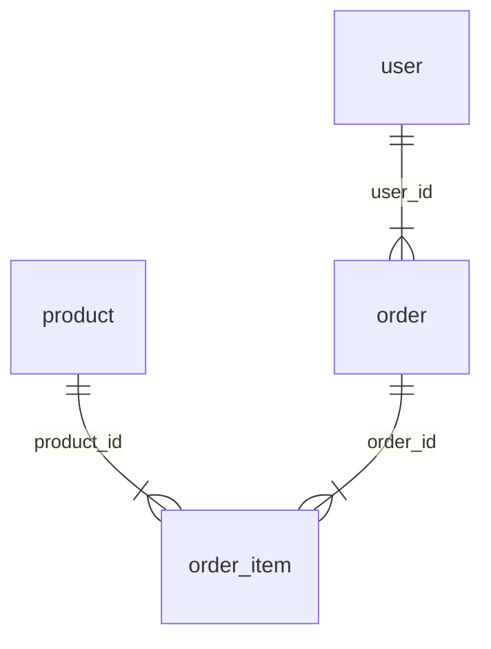

# 业务场景模拟器 - 网页版设计文档

**日期**: 2026-05-08
**状态**: 待实现

---

## 一、概述

用户输入一个行业名称（如"电商"、"医疗"、"物流"）和探查深度（1/2/≥3），自动生成该行业的业务场景模拟网页，包含：

- 业务线清单及描述
- 各业务线下的业务流程（文字 + Mermaid 流程图）
- 业务流程涉及的表结构（DDL + 字段清单）
- 表中模拟的真实数据（INSERT 语句 + 表格预览）
- ER 关系图（展示表间关联）

输出为**单文件静态 HTML**，双击即可打开，无需任何服务器或构建工具。

---

## 二、输入输出

### 输入

| 参数 | 类型 | 说明 |
|------|------|------|
| 行业名称 | 文本 | 如"电商"、"金融"、"医疗"、"教育" |
| 探查深度 | 数字 | 1=轻量级, 2=中等, ≥3=深度建模 |

### 深度参数映射

| 探查次数 | 业务线数 | 每业务表数 | 流程描述 | 模拟数据量 |
|---------|---------|-----------|---------|-----------|
| 1 | 2-3 | 3-5 | 纯文字描述 | 每表 5-10 条 |
| 2 | 4-5 | 5-10 | 文字 + Mermaid 流程图 | 每表 10-20 条 |
| ≥3 | 5-8 | 10-20 | 完整流程图 + 异常分支 | 每表 20-50 条 |

### 输出

单个 HTML 文件，包含完整交互界面。

---

## 三、页面布局

```
┌──────────────────────────────────────────────────────────────┐
│  📊 业务场景模拟器                                              │
│  行业：[输入框]  深度：[1 ▼]  [▶ 生成]  [⚙]                    │
────────────┬─────────────────────────────────────────────────┤
│            │                                                 │
│ 左侧导航    │  Tab: [业务流程] [表结构] [模拟数据] [ER图]        │
│            │  ─────────────────────────────────────────────  │
│ ▼ 业务线A  │                                                 │
│   ├ 流程1  │  【当前选中业务线的内容】                          │
│   ├ 流程2  │                                                 │
│   └ 流程3  │  根据 Tab 切换显示：                              │
│            │  - 业务流程：流程描述 + Mermaid 流程图             │
│ ▼ 业务线B  │  - 表结构：字段清单表格 + DDL 代码块               │
│   ├ 流程1  │  - 模拟数据：可滚动数据表格 + INSERT 语句          │
│   └ 流程2  │  - ER图：Mermaid erDiagram 渲染                  │
│            │                                                 │
│ ▼ 业务线C  │                                                 │
│   └ 流程1  │                                                 │
│            │                                                 │
├────────────┴─────────────────────────────────────────────────┤
│  📦 共 X 个业务线 · Y 张表 · 深度：中等(2) · 生成时间           │
──────────────────────────────────────────────────────────────┘
```

⚙ 按钮：点击弹出 API 配置面板（API 地址、Key、模型）

---

## 四、技术架构

### 4.1 技术栈

| 组件 | 方案 | 说明 |
|------|------|------|
| 布局 | CSS Grid + Flexbox | 响应式三栏布局 |
| 左侧导航 | 纯 CSS + 少量 JS | 手风琴折叠菜单 |
| Tab 切换 | JS 控制 class | 无框架实现 |
| 流程图 | Mermaid CDN | `mermaid.min.js` |
| 代码高亮 | highlight.js CDN | DDL 语法高亮 |
| 数据生成 | 调用 OpenAI 兼容 API | 用户输入行业+深度，实时生成 |
| 数据存储 | localStorage | 保存 API 配置和最近一次生成结果 |

### 4.2 外部依赖（CDN）

```html
<script src="https://cdn.jsdelivr.net/npm/mermaid@10/dist/mermaid.min.js"></script>
<link rel="stylesheet" href="https://cdn.jsdelivr.net/npm/highlight.js@11/styles/github.min.css">
<script src="https://cdn.jsdelivr.net/npm/highlight.js@11/highlight.min.js"></script>
```

### 4.3 API 调用设计

**配置项（存储在 localStorage）：**
- `apiBaseUrl`: API 基础地址，默认 `https://api.openai.com/v1`
- `apiKey`: API Key
- `apiModel`: 模型名称，默认 `gpt-4o`

**生成请求：**
```javascript
fetch(apiBaseUrl + '/chat/completions', {
  method: 'POST',
  headers: {
    'Content-Type': 'application/json',
    'Authorization': 'Bearer ' + apiKey
  },
  body: JSON.stringify({
    model: apiModel,
    messages: [
      { role: 'system', content: '你是一个数据建模专家...' },
      { role: 'user', content: '请为${industry}行业生成业务场景数据，深度=${depth}...' }
    ],
    response_format: { type: 'json_object' }
  })
})
```

**System Prompt 要点：**
- 表命名使用业务意义名称，禁止 dim_/dwd_/dws_ 等数仓前缀
- 返回纯 JSON，符合预定义 schema
- 深度 1/2/3 对应不同的业务线数量、表数量、数据量

### 4.3 文件结构

所有生成文件统一输出到 `/Users/chuixue/Desktop/data-dev/data-skills/Data-Profiling/` 目录下：

```
/Users/chuixue/Desktop/data-dev/data-skills/Data-Profiling/
├── SKILL.md                                    # Skill 入口文件
├── biz-scenario-{行业}-{时间戳}.html           # 生成的业务场景网页
├── templates/
│   └── index.html                              # HTML 页面模板（骨架）
├── scripts/
│   ├── generate.js                             # 主生成逻辑（流水线分步调用）
│   ├── render.js                               # 页面渲染逻辑（数据→HTML）
│   └── increment.js                            # 增量迭代逻辑
└── output/                                     # 历史生成记录（可选归档）
    └── biz-scenario-电商-20260508.html
```

Skill 执行时，所有输出文件（HTML、模板、脚本）均存放在该目录及其子目录下。

---

## 五、数据模型

### 5.0 表命名规范

**使用有业务意义的名称**，如 `product`、`order`、`student`、`course` 等。
**禁止使用数仓分层前缀**（dim_、dwd_、dws_、ods_ 等）。

### 5.1 业务数据 JSON 结构

```json
{
  "industry": "电商",
  "depth": 2,
  "generateTime": "2026-05-08 14:30:00",
  "businessLines": [
    {
      "name": "商品管理",
      "description": "商品的全生命周期管理",
      "processes": [
        {
          "name": "商品录入",
          "description": "商家提交商品信息，平台审核后上架",
          "flowchart": "graph LR\nA[商家提交] --> B{平台审核}\nB -->|通过| C[上架]\nB -->|驳回| D[修改]",
          "tables": ["product", "product_audit"]
        }
      ],
      "tables": [
        {
          "name": "product",
          "comment": "商品表",
          "columns": [
            { "name": "product_id", "type": "BIGINT", "comment": "商品ID", "isPk": true },
            { "name": "product_name", "type": "VARCHAR(256)", "comment": "商品名称" },
            { "name": "category_id", "type": "BIGINT", "comment": "类目ID" },
            { "name": "price", "type": "DECIMAL(10,2)", "comment": "售价" },
            { "name": "status", "type": "TINYINT", "comment": "状态 0下架 1上架" }
          ],
          "ddl": "CREATE TABLE product (...);",
          "data": [
            { "product_id": 1001, "product_name": "iPhone 15", "category_id": 101, "price": 5999.00, "status": 1 }
          ]
        }
      ],
      "relations": [
        { "from": "product", "to": "order_item", "type": "1:N", "field": "product_id" },
        { "from": "order", "to": "order_item", "type": "1:N", "field": "order_id" }
      ]
    }
  ]
}
```

### 5.2 ER 图数据

从 `relations` 数组中提取，按**当前选中的业务线**过滤，生成 Mermaid erDiagram 语法。

**关系类型映射：**

| type 值 | Mermaid 语法 | 含义 |
|---------|-------------|------|
| `1:1` | `\|\|--\|\|` | 一对一 |
| `1:N` | `\|\|--\|{` | 一对多 |
| `N:1` | `}\|--\|\|` | 多对一 |
| `M:N` | `}\|--\|{` | 多对多 |



**注意：** ER 图只显示当前选中业务板块的表间关系，不显示其他业务板块。

---

## 六、核心工作流

### 6.1 两种使用模式

**模式 A：API 直连（模板直接使用）**
```
用户打开 templates/index.html
    │
    ▼
点击 ⚙ 配置 API Key 和地址
    │
    ▼
输入行业名称 + 选择深度
    │
    ▼
点击"生成"按钮
    │
    ▼
页面调用 API → 解析 JSON → 渲染页面
```

**模式 B：AI 预生成（离线 HTML）**
```
用户告诉 AI: "帮我生成电商行业业务场景，深度2"
    │
    ▼
AI 调用 API 生成 JSON 数据
    │
    ▼
AI 将数据注入模板
    │
    ▼
输出 biz-scenario-{行业}-{时间戳}.html
    │
    ▼
用户打开生成的 HTML（无需 API，离线可用）
```

### 6.2 API 调用流程（模式 A）

```
用户点击"生成"
    │
    ▼
读取 localStorage 中的 API 配置
    │
    ▼
┌─────────────────────────────────────────┐
│ POST {baseUrl}/chat/completions          │
│ headers: Authorization: Bearer {apiKey}  │
│ body: {                                   │
│   model, messages,                        │
│   response_format: {type:"json_object"}   │
│ }                                         │
└──────────────┬──────────────────────────┘
               ▼
┌─────────────────────────────────────────
│ 解析响应，提取 JSON                       │
│ 处理 markdown 代码块包裹                  │
└──────────────┬──────────────────────────┘
               ▼
┌─────────────────────────────────────────┐
│ 渲染页面：侧边栏、Tab 内容、ER 图          │
└─────────────────────────────────────────┘
```

### 6.3 错误处理

| 错误场景 | 处理方式 |
|---------|---------|
| 未配置 API Key | 弹窗提示用户点击右上角 ⚙ 配置 |
| API 请求失败 | 显示错误信息，保留页面可重新尝试 |
| JSON 解析失败 | 提示"API 返回格式异常"，显示原始响应 |
| 网络超时 | 提示"请求超时，请检查网络或 API 地址" |

---

## 七、交互细节

### 7.1 左侧导航

- 点击业务线名称：展开/收起子流程列表（手风琴效果）
- 点击具体流程：中间区域切换到该流程内容
- 当前选中项高亮显示
- 支持"全部展开"/"全部收起"按钮

### 7.2 Tab 切换

- **业务流程**: 显示流程描述 + Mermaid 流程图（如深度≥2）
- **表结构**: 显示字段清单表格 + DDL 代码块（带复制按钮）
- **模拟数据**: 显示可滚动数据表格 + INSERT 语句
- **ER图**: 显示 Mermaid erDiagram 渲染的关系图

### 7.3 底部状态栏

显示：业务线数量 · 表总数 · 当前深度 · 生成时间 · 导出按钮

---

## 八、样式规范

### 8.1 配色方案

| 元素 | 色值 | 说明 |
|------|------|------|
| 主色 | `#1890ff` | 按钮、链接、高亮 |
| 背景 | `#f5f7fa` | 页面背景 |
| 左侧导航 | `#001529` | 深色侧边栏 |
| 卡片背景 | `#ffffff` | 内容区卡片 |
| 边框 | `#e8e8e8` | 分割线 |
| 文字主色 | `#262626` | 正文 |
| 文字辅色 | `#8c8c8c` | 辅助信息 |

### 8.2 字体

```css
font-family: -apple-system, BlinkMacSystemFont, "Segoe UI", Roboto, "Helvetica Neue", Arial, sans-serif;
```

### 8.3 间距

- 卡片内边距：16px
- 元素间距：8px / 12px / 16px / 24px
- 左侧导航宽度：240px

---

## 九、边界情况

| 场景 | 处理方式 |
|------|---------|
| 行业名称为空 | 提示"请输入行业名称" |
| 深度参数非数字 | 默认按深度=1 处理 |
| 未配置 API Key | 弹窗引导用户配置 |
| API 请求失败 | 显示错误信息，可重试 |
| JSON 解析失败 | 提示格式异常，显示原始响应 |
| 浏览器不支持 Mermaid | 降级显示纯文本流程图 |
| localStorage 不可用 | API 配置无法保存，每次需重新输入 |

---

## 十、Skill 规范

### 10.1 Skill 元数据

```yaml
---
name: 业务场景模拟
description: 输入一个行业名称，生成行业有哪些业务，各个业务下的业务流程是怎么样的，业务流程有哪些表，表中模拟一些真实数据。输出为交互式网页。
---
```

### 10.2 触发条件

用户提到以下关键词时触发：
- "业务场景"、"行业模拟"、"生成表结构"、"模拟数据"
- 输入行业名称 + 深度参数

### 10.3 使用方式

**方式一：直接使用模板（推荐）**
```
1. 打开 Data-Profiling/templates/index.html
2. 点击 ⚙ 配置 API Key
3. 输入行业名称，选择深度
4. 点击"生成"
```

**方式二：AI 预生成离线文件**
```
用户: 帮我生成电商行业的业务场景，深度2
AI:  [调用 API 生成数据] → [注入模板] → 输出 biz-scenario-dianshang-20260509.html

用户: 把深度改为3，继续深化
AI:  [读取已有 HTML] → [重新生成] → 更新文件
```
